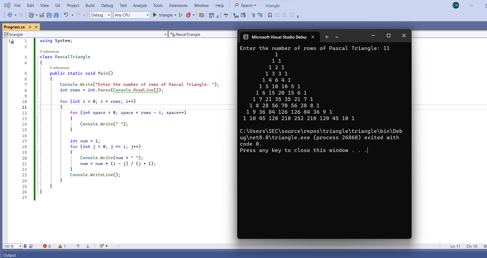

# Exp02-CSharpPattern

## Aim:
To write a C# program for a pascal's triangle.

## Algorithm:
### Step1: 
create a class

### Step2: 
Give the input values

### Step3: 
use nested for loop

### Step4: 
Display the output

### Step5: 
End the program.

## Program:
##### Developed by: Shiak Sameer Basha

##### Register no: 212222240093
```python

using System;

class PascalTriangle
{
    public static void Main()
    {
        Console.Write("Enter the number of rows of Pascal Triangle: ");
        int rows = int.Parse(Console.ReadLine());

        for (int i = 0; i < rows; i++)
        {
            for (int space = 0; space < rows - i; space++)
            {
                Console.Write(" ");
            }

            int num = 1;
            for (int j = 0; j <= i; j++)
            {
                Console.Write(num + " ");
                num = num * (i - j) / (j + 1);
            }
            Console.WriteLine();
        }
    }
}
```
## Output:


## Result:
Thus the C# program to print the pascal's triangle is executed successfully.